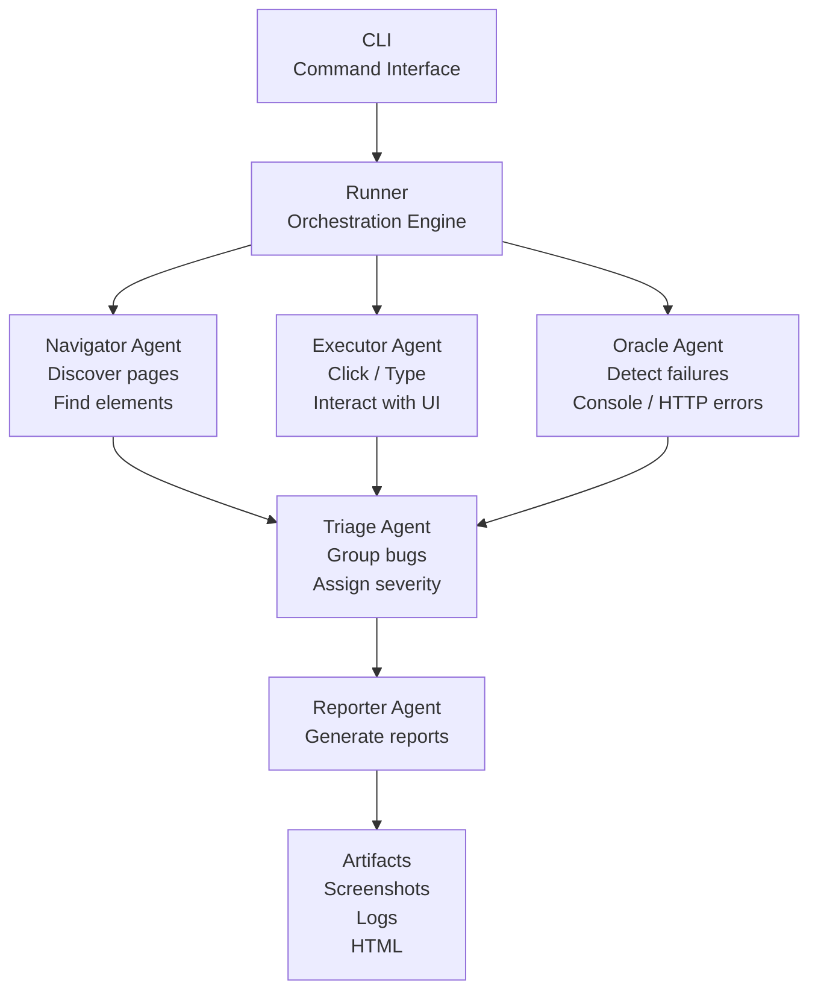

# AutoWebsiteTester

AutoWebsiteTester is an open-source, AI-powered QA engineer that explores websites, simulates user behavior, detects failures, and generates reproducible bug reports with rich evidence.

## Why this project

Manual website QA is slow and inconsistent. AutoWebsiteTester automates exploratory testing by crawling pages, interacting with UI controls, capturing failures, and outputting actionable reports for engineering teams.

## Core capabilities

- **Website exploration** with BFS crawling constrained to the same domain.
- **User interaction simulation** for links, buttons, forms, and inputs.
- **Failure detection** for:
  - JavaScript console errors
  - HTTP/network failures (4xx/5xx)
  - request timeout symptoms
  - broken links and unresponsive UI signals
  - blank pages and missing/empty DOM
- **Evidence collection** per failure:
  - screenshot
  - HTML snapshot
  - console logs
  - network summary
  - reproduction steps
- **Bug triage** that groups duplicates and assigns severity:
  - `P0`: critical feature broken
  - `P1`: major functionality failure
  - `P2`: minor UI issue
  - `P3`: improvement suggestion
- **Reporting outputs**:
  - `report.md`
  - `report.html`
  - `results.json`

## Quick start

### 1. Install

```bash
python -m venv .venv
source .venv/bin/activate
pip install -e .[dev]
playwright install chromium
```

### 2. Run scan

```bash
autowebsitetester scan https://example.com --depth 3 --max-pages 50 --out ./report
```

### 3. Inspect results

Generated output directory includes:

- `report/report.md`
- `report/report.html`
- `report/results.json`
- `report/artifacts/*.png`
- `report/artifacts/*.html`

## CLI reference

```bash
autowebsitetester scan URL [OPTIONS]
```

### Options

- `--depth INTEGER` BFS crawl depth (default: `3`)
- `--max-pages INTEGER` max pages to visit (default: `50`)
- `--headless / --no-headless` run browser headless (default: `--headless`)
- `--ai-analysis / --no-ai-analysis` optional AI analysis hooks (default: off)
- `--out TEXT` output directory (default: `./report`)

### Examples

```bash
# Basic scan
autowebsitetester scan https://example.com

# Deeper scan with more pages
autowebsitetester scan https://example.com --depth 4 --max-pages 120

# Debug mode with visible browser
autowebsitetester scan https://example.com --no-headless --out ./tmp/report
```

## Architecture diagram



## Project structure

```text
autowebsitetester/
  cli.py
  runner.py
  config.py
  browser/
    session.py
    actions.py
    detectors.py
    snapshot.py
  agents/
    navigator.py
    executor.py
    oracle.py
    triage.py
    reporter.py
  report/
    render_md.py
    render_html.py
  schemas/
    results.schema.json
examples/
  config.example.toml
tests/
  test_triage.py
```

## Notes

- Designed for Python **3.11+**.
- Built with async Playwright architecture.
- Optional AI integrations can be layered in via OpenAI API.
